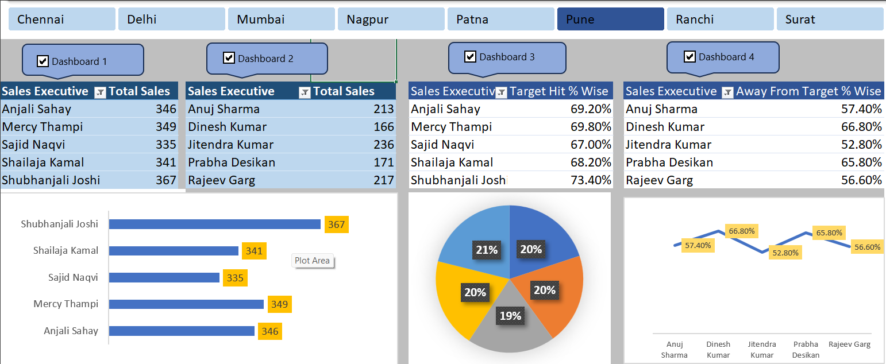

Here is a clean and professional **README.md** without emoticons:

---

# Sales Analysis Dashboard (Excel)

## Overview

This project is an interactive Sales Analysis Dashboard built using Microsoft Excel. It provides insights into sales performance across multiple cities and sales executives by visualizing key metrics such as total sales, target achievement percentage, and performance gaps.

---

## Features

* City-wise filtering (Chennai, Delhi, Mumbai, Pune, etc.)
* Sales Executive performance tracking
* Total Sales comparison
* Target Hit % analysis
* Away from Target % insights
* Interactive charts (Bar, Pie, Line)
* Dynamic dashboard navigation

---

## Dashboard Preview



---

## Tools and Technologies

* Microsoft Excel
* Pivot Tables
* Charts and Graphs
* Data Visualization Techniques

---

## Project Structure

```
Sales-Analysis-Dashboard/
│-- dashboard.xlsx
│-- dashboard.png
│-- README.md
```

---

## Use Case

This dashboard can be used by sales managers and analysts to monitor team performance, identify top performers, track target achievement, and support data-driven decision-making.

---

## Key Insights

* Compare performance across different cities
* Identify gaps in target achievement
* Analyze trends and performance patterns

---

## Conclusion

This project demonstrates practical skills in Excel dashboard development, data analysis, and business intelligence.
